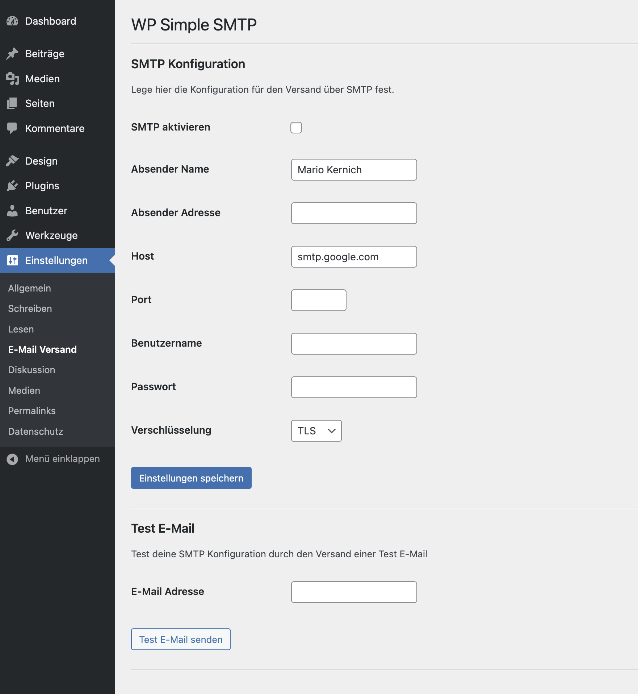

# WordPress Simple SMTP Plugin

This plugin add settings to WordPress which enable mail delivery within SMTP. The plugin is very simple, no extra overheat.

**List of features:**

-   Configure SMTP options
-   Enable or disable SMTP delivery
-   Send test mail to verify SMTP options
-   Translations for english and german

## Screenshot

## Backlog

For more details see: https://github.com/users/marioke/projects/1
